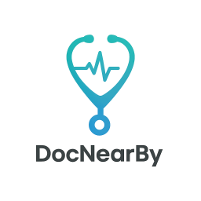

# DocNearby: Revolutionizing Healthcare - Connecting Symptoms to Nearby Doctors

---




  
---

## ✨ Project Overview

**DocNearby** is an innovative full-stack web application born from the **PixelRush Hackathon** at RTMSSU's Foundation Week 2024. It's designed to **revolutionize healthcare access** by seamlessly connecting individuals experiencing medical symptoms with qualified doctors in their vicinity. Our platform leverages cutting-edge technology, including **Artificial Intelligence**, to simplify symptom analysis, predict potential diseases, and provide tailored recommendations for healthcare providers.

The core objective of DocNearby is to bridge the gap in patient-doctor connection, especially in areas where accessing timely and accurate medical attention can be challenging. By offering intuitive interfaces and reliable information, DocNearby aims to make healthcare more accessible and intuitive for everyone.

---

## 🏆 Hackathon & Problem Statement

### Event Details
* **Event:** PixelRush Hackathon, Foundation Week 2024
* **Participants:** BTech IT/CT/MTX Sem4 Students of RTMSSU
* **Theme:** Revolutionizing Healthcare: Connecting Symptoms to Nearby Doctors

### The Challenge We Addressed

Access to timely and accurate medical attention is critical. However, individuals often struggle with identifying the right medical professional, locating nearby facilities, or accessing relevant information during emergencies. These barriers are particularly acute in regions with limited healthcare infrastructure.

Our mission was to design a user-centric platform that simplifies this process by:

* **Enabling Registration:** Allowing both **doctors and patients** to register on the platform.
* **Intelligent Symptom Analysis:** Helping users input and **analyze symptoms effectively**, utilizing **AI to predict potential diseases**.
* **Tailored Recommendations:** Providing **personalized recommendations** for nearby doctors, clinics, or hospitals based on symptoms and doctor specializations (powered by AI).
* **Enhancing User Experience:** Building intuitive interfaces and ensuring reliable information delivery.

### Key Challenges Overcome

During the hackathon, we focused on addressing crucial challenges:

* **Accuracy:** Ensuring precise symptom analysis and accurate doctor specialization matching.
* **Geolocation:** Incorporating real-time geolocation services for healthcare provider discovery.
* **Data Privacy:** Maintaining strict data privacy and confidentiality for user information.
* **Comprehensive Features:** Integrating features like appointment booking, emergency contacts, and feedback mechanisms.
* **Diverse Demographics:** Designing the solution to cater to both tech-savvy users and those less familiar with technology.
* **AI Integration:** Effectively utilizing **Artificial Intelligence, Machine Learning, and data analytics** to improve symptom analysis and doctor matching.
* **Offline Capabilities:** Considering future integration of offline capabilities for regions with poor internet connectivity.

---

## 🚀 Project Structure & Technologies

DocNearby is built as a robust full-stack web application.

### Architecture
* `docnearby_project/`: This directory houses the **Django REST API backend**. It manages:
    * User and Doctor authentication and profiles
    * Appointment scheduling and management
    * Symptom input and AI-driven analysis
    * Doctor matching and recommendations
    * Feedback system
* `docnearby-frontend/`: This directory contains the **React frontend**, providing the dynamic and user-friendly interface.

### Core Features

* **Smart Doctor Search:** Efficiently search and filter doctors based on specialization, availability, and location.
* **Seamless Appointment Booking:** Book and manage appointments with ease through an intuitive interface.
* **Personalized Dashboards:** Dedicated dashboards for both patients and doctors for easy management of their activities.
* **AI-Powered Symptom Analysis:** Input your symptoms and receive AI-driven insights and potential disease predictions.
* **Integrated Feedback System:** Provide and receive feedback to improve healthcare experiences.
* **Geolocation-Based Services:** Find healthcare providers in your immediate vicinity.

---

## ⚙️ Getting Started

Follow these steps to set up and run DocNearby on your local machine for development and testing.

### Prerequisites

Before you begin, ensure you have the following software installed:

* **Node.js**: `v16.0` or higher (includes `npm`)
* **Python**: `v3.8` or higher
* **PostgreSQL** (Recommended for production-like environment)
* **Git**: For cloning the repository
* **pip**: Python package installer (usually comes with Python)
* **virtualenv** (or Python's built-in `venv`): For creating isolated Python environments

### Installation

1.  **Clone the Repository:**
    Start by cloning the DocNearby repository:
    ```bash
    git clone [https://github.com/tejasbhor/DocNearby.git](https://github.com/tejasbhor/DocNearby.git)
    cd DocNearby
    ```
    *(**Remember to replace `your-username` with the actual GitHub username or organization name for your repository!**)*

2.  **Backend Setup (Django)**
    Navigate to the backend directory and set up the Python environment:
    ```bash
    cd docnearby_project

    # Create a virtual environment
    python -m venv .venv

    # Activate the virtual environment
    # On macOS/Linux:
    source .venv/bin/activate
    # On Windows:
    # .venv\Scripts\activate

    # Install Python dependencies
    pip install -r requirements.txt # Assuming requirements.txt is in the root or adjust path
    ```
    * **Database Configuration:** Configure your `settings.py` for your database (e.g., PostgreSQL).
        ```python
        # In docnearby_project/docnearby_project/settings.py
        DATABASES = {
            'default': {
                'ENGINE': 'django.db.backends.postgresql', # or 'django.db.backends.sqlite3'
                'NAME': 'docnearby_db', # Or your database name
                'USER': 'your_db_user', # If using PostgreSQL
                'PASSWORD': 'your_db_password', # If using PostgreSQL
                'HOST': 'localhost', # Or your database host
                'PORT': '', # Or your database port
            }
        }
        ```
        *If using PostgreSQL, ensure it's running and you've created the database and user.*

3.  **Frontend Setup (React)**
    Open a **new terminal** or navigate back to the root `DocNearby` directory, then proceed to the frontend setup:
    ```bash
    cd docnearby-frontend

    # Install Node.js dependencies
    npm install
    # or if you prefer yarn:
    # yarn install
    ```
    * **Environment Variables (Frontend):** Create a `.env` file in `docnearby-frontend/` if your frontend needs to connect to the backend API.
        ```env
        # .env (in docnearby-frontend directory)
        REACT_APP_API_URL=http://localhost:8000/api
        ```

### Running the Application

With everything configured, you can now run both the backend and frontend servers.

1.  **Run Backend Migrations & Start Server:**
    * Ensure you are in the `docnearby_project` directory with your virtual environment activated.
    * Apply database migrations:
        ```bash
        python manage.py migrate
        ```
    * Create a superuser (optional, for admin access):
        ```bash
        python manage.py createsuperuser
        ```
    * Start the Django development server:
        ```bash
        python manage.py runserver
        ```
        The backend API will typically be accessible at `http://localhost:8000`.

2.  **Start the Frontend Development Server:**
    * Open a **new terminal window/tab**.
    * Navigate to the `docnearby-frontend` directory.
    * Start the React development server:
        ```bash
        npm start
        # or if you prefer yarn:
        # yarn start
        ```
    The frontend application will typically be available at `http://localhost:3000` (or another port if `3000` is in use).

---

## 💻 Usage

Once both the backend and frontend servers are successfully running:

1.  Open your web browser and navigate to `http://localhost:3000` (or the port indicated by `npm start`).
2.  **Register** as a new patient or doctor, or **Log In** if you already have an account.
3.  **Patients** can input their symptoms, view predicted diseases, and find recommended doctors nearby.
4.  **Doctors** can manage their profiles, view appointments, and interact with patient feedback.
5.  Explore the **Django Admin interface** at `http://localhost:8000/admin/` using your superuser credentials to manage data and users.

---

## 📄 API Documentation

While not explicitly set up in the provided project structure, a Django REST Framework backend can easily integrate API documentation. Consider adding:

* **Swagger UI / Redoc:** Tools like `drf-yasg` or `djangorestframework-spectacular` can generate interactive API documentation automatically. You could access it at `http://localhost:8000/swagger/` or `http://localhost:8000/redoc/`.

This documentation would detail endpoints for:

* `/api/auth/`: User and Doctor Authentication (Registration, Login, Profile Management)
* `/api/doctors/`: Doctor management and search
* `/api/patients/`: Patient management
* `/api/appointments/`: Appointment booking and management
* `/api/symptoms/`: Symptom input and analysis
* `/api/feedback/`: Feedback submission and retrieval

---

## 🤝 Contributing

We welcome contributions to DocNearby! If you're interested in improving this project, please follow these guidelines:

1.  **Fork the Repository:** Start by forking the DocNearby repository to your GitHub account.
2.  **Create a Feature Branch:** For new features or bug fixes, create a dedicated branch:
    ```bash
    git checkout -b feature/your-new-feature
    # Example: git checkout -b feat/add-video-consultation
    ```
3.  **Make Your Changes:** Implement your feature or fix, ensuring code quality and adherence to best practices.
4.  **Commit Your Changes:** Write clear, concise, and descriptive commit messages.
    ```bash
    git commit -m 'feat: Implement feature X' -m 'Detailed explanation of the new functionality.'
    ```
5.  **Push to Your Branch:**
    ```bash
    git push origin feature/your-new-feature
    ```
6.  **Open a Pull Request (PR):**
    * Go to your forked repository on GitHub.
    * Open a Pull Request from your branch to the `main` branch of the original DocNearby repository.
    * Provide a thorough description of your changes in the PR.

---

## 🗺️ Roadmap

Here are some potential future enhancements for DocNearby:

* [ ] Integration of a more advanced, fine-tuned **AI/ML model** for highly accurate disease prediction.
* [ ] Implementation of **real-time chat/video consultation** features.
* [ ] Support for **multiple languages** to cater to a wider audience.
* [ ] Dedicated **mobile applications** (iOS/Android) for enhanced accessibility.
* [ ] Offline capabilities for symptom input and basic doctor information in areas with limited connectivity.
* [ ] Advanced analytics for health trends and public health insights.
* [ ] Integration with electronic health records (EHR) systems (with strict privacy controls).

*(This roadmap is subject to change based on community feedback, research, and resource availability.)*

---

## 📝 License

This project is licensed under the **MIT License**. See the [LICENSE](LICENSE) file in the root of this repository for more details.

---

## 📞 Contact & Support

Have questions, need support, or want to connect?

* **Project Repository:** [https://github.com/tejasbhor/DocNearby](https://github.com/tejasbhor/DocNearby) * 
* **Report an Issue:** [https://github.com/tejasbhor/DocNearby/issues](https://github.com/tejasbhor/DocNearby/issues) * 

## 🙏 Acknowledgments

A heartfelt thank you to:

* The **PixelRush Hackathon** organizers and RTMSSU for providing this incredible opportunity.
* The developers of **Django**, **React**, and other open-source technologies that made this project possible.
* All **team members** who contributed their skills and dedication to DocNearby.
* The wider **open-source community** for their invaluable resources and inspiration.
